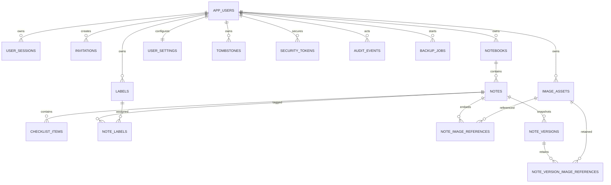

# PostgreSQL domain model

Portable content is keyed by `(owner_id, id)`. This allows two accounts to import the same
desktop UUIDs without collision while making cross-owner foreign keys structurally invalid.

All synchronizable mutable rows use UUIDs, `timestamptz` creation/update timestamps, and a
non-negative optimistic `BIGINT` version. PostgreSQL check constraints protect string-backed
enums without coupling future migrations to PostgreSQL enum types.

Invitation and password-reset rows persist only domain-separated token hashes. Persistent endpoint
rate-limit rows are keyed by scope and a keyed client/identifier hash; raw addresses, reset tokens,
and invitation tokens are not stored.

The note search vector uses the language-neutral `simple` configuration for title and content.
M8 may extend vector maintenance to relational checklist and label text without changing note IDs.
