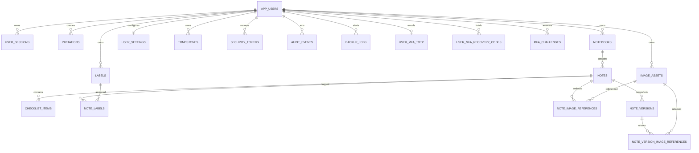

# PostgreSQL domain model

Portable content is keyed by `(owner_id, id)`. This allows two accounts to import the same
desktop UUIDs without collision while making cross-owner foreign keys structurally invalid.

```mermaid
erDiagram
  APP_USERS ||--o{ USER_SESSIONS : owns
  APP_USERS ||--o{ INVITATIONS : creates
  APP_USERS ||--o{ NOTEBOOKS : owns
  APP_USERS ||--o{ LABELS : owns
  APP_USERS ||--o{ IMAGE_ASSETS : owns
  APP_USERS ||--|| USER_SETTINGS : configures
  NOTEBOOKS ||--o{ NOTES : contains
  NOTES ||--o{ CHECKLIST_ITEMS : contains
  NOTES ||--o{ NOTE_LABELS : tagged
  LABELS ||--o{ NOTE_LABELS : assigned
  NOTES ||--o{ NOTE_IMAGE_REFERENCES : embeds
  IMAGE_ASSETS ||--o{ NOTE_IMAGE_REFERENCES : referenced
  NOTES ||--o{ NOTE_VERSIONS : snapshots
  NOTE_VERSIONS ||--o{ NOTE_VERSION_IMAGE_REFERENCES : retains
  IMAGE_ASSETS ||--o{ NOTE_VERSION_IMAGE_REFERENCES : retained
  APP_USERS ||--o{ TOMBSTONES : owns
  APP_USERS ||--o{ SECURITY_TOKENS : secures
  APP_USERS ||--o{ AUDIT_EVENTS : acts
  APP_USERS ||--o{ BACKUP_JOBS : starts
  APP_USERS ||--o| USER_MFA_TOTP : enrolls
  APP_USERS ||--o{ USER_MFA_RECOVERY_CODES : holds
  APP_USERS ||--o{ MFA_CHALLENGES : answers
```

All synchronizable mutable rows use UUIDs, `timestamptz` creation/update timestamps, and a
non-negative optimistic `BIGINT` version. PostgreSQL check constraints protect string-backed
enums without coupling future migrations to PostgreSQL enum types.

Invitation and password-reset rows persist only domain-separated token hashes. Persistent endpoint
rate-limit rows are keyed by scope and a keyed client/identifier hash; raw addresses, reset tokens,
and invitation tokens are not stored.

## Second-factor tables

`user_mfa_totp` holds at most one enrollment per account. The shared TOTP secret is stored as
AES-256-GCM ciphertext with a per-row nonce and the identifier of the key that produced it, so the
enrollment encryption secret can be rotated without re-enrolling every account. The algorithm, digit
count, and period are persisted per enrollment rather than read from configuration, so changing the
defaults never invalidates an authenticator that is already paired. `last_accepted_step` records the
most recent accepted time step and makes replay of an observed code impossible within its validity
window. A `PENDING` row is an enrollment that has not yet proven possession; only `ACTIVE` rows carry
a `confirmed_at`.

`user_mfa_recovery_codes` stores one domain-separated keyed hash per code, so verification is a single
indexed lookup rather than a sequence of password-hash comparisons on an unauthenticated path. A code
is spent by stamping `used_at`, never by deletion, so the audit trail survives.

`mfa_challenges` is the short-lived server-side state between a correct password and a correct second
factor. Only the hash of the challenge token is persisted; `attempt_count` bounds guessing, and the
partial index on unconsumed rows keeps expiry purges cheap. `user_sessions.second_factor_verified_at`
records the most recent successful step-up so sensitive operations can require a fresh one.

`login_rate_limits` gained an `MFA_IP` scope alongside `IDENTIFIER` and `IP`. The scope check
constraint was widened, not narrowed: the replacement admits a strict superset and every pre-existing
row satisfies it.

`instance_settings` gained four bounded tunables: challenge lifetime in minutes (default 5, range
1–30), the per-challenge attempt cap (default 5, range 3–10), pending-enrollment expiry in minutes
(default 30, range 5–120), and the step-up grace window in minutes (default 5, range 0–60, where 0
disables the grace period and forces a step-up every time).

The generated note search vector uses the language-neutral `simple` configuration with weighted
title, Markdown source, and checklist text. Checklist triggers maintain the relational text aggregate,
and a GIN index supports ranked full-text queries without changing portable note IDs.
